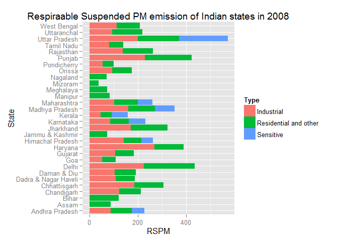

# Respirable Suspended Particulate matter of Indian states in 2008
Vikrant Yadav  
30 September 2015  

Air Quality with respect to Respirable Suspended Particulate Matter(RSPM) in air quality stations under National Air Quality Monitoring Programme (NAMP)in the year 2008. The dataset can be obtained from [here](https://data.gov.in/catalog/air-quality-respect-respirable-suspended-particulate-matterrspm-air-quality-stations-under#web_catalog_tabs_block_10).  

******

### Synopsis

The ambient air quality monitoring network comprises of 342 monitoring stations covering 128 cities/towns of the country. The data is sourced from National ambient air quality status & trends in India-2008(NAMP). NA- Data not available/outlier/not classified(Less than 50 Monitoring days) ; n- number of days monitored for 16 and more hours a day; Low, Moderate, High and Critical levels of pollution based on exceedence factor (calculated for n >50 days), percentage violation of NAAQS (24 hourly average).  
Here we make a descriptive analysis of the air quality of all the states as per the type of pollutants.  

```r
library(ggplot2)
library(dplyr)
```

```
## Warning: package 'dplyr' was built under R version 3.2.2
```

```
## 
## Attaching package: 'dplyr'
## 
## The following objects are masked from 'package:stats':
## 
##     filter, lag
## 
## The following objects are masked from 'package:base':
## 
##     intersect, setdiff, setequal, union
```

******

### Data Processing

The dataset is grouped as per the State and Type of emission and later the PM values are averaged out.  
The *Air_Quality_RSPM_2008.csv* can be downloaded from [here](https://data.gov.in/sites/default/files/datafile/Air_Quality_RSPM_2008.csv).

```r
air.quality <- read.csv('https://data.gov.in/sites/default/files/datafile/Air_Quality_RSPM_2008.csv')
colnames(air.quality)[5:7] <- c('Confidence', 'RSPM', 'Percentage')
air.quality <- group_by(air.quality, State, Type)
air.quality <- summarise(air.quality, RSPM = mean(RSPM))
ggplot(air.quality, aes(x = State, y = RSPM)) + geom_bar(stat = 'identity', aes(fill = Type)) +
labs(title = 'Respiraable Suspended PM emission of Indian states in 2008', xlab = 'States', ylab = 'Particulate matter') + coord_flip()
```

 

******

### Result

Uttar Pradesh has the highest cumulative PM(particulate matter) emission in the country, while Haryana has the highest Industrial PM emission followed by Delhi.
